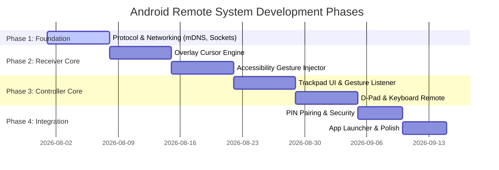

# Dual-APK Android Mouse & Keyboard Remote System
## Project Concept & Technical Breakdown

---

## 1. Executive Summary & Core Concept

This project defines a two-part Android software system (**Controller APK** and **Receiver APK**) designed to turn any Android phone or tablet into a versatile mouse, trackpad, keyboard, and D-pad remote for another Android device—with primary optimization for **Android TV (Android 9 / API 28+)**.

### Primary Goal
Provide an intuitive, low-latency, non-root control experience for Android TV boxes, smart TVs, and streaming dongles where native mouse navigation and text input are traditionally cumbersome using standard IR remotes.

```
+------------------------------------+                  +------------------------------------+
|         CONTROLLER APK             |                  |            RECEIVER APK            |
|       (Phone / Tablet)             |   Local Wi-Fi    |      (Android TV / Host Box)       |
|                                    |                  |                                    |
|  - Multi-touch Trackpad            |  TCP / UDP / mDNS|  - mDNS Beacon & Auto-Pairing       |
|  - On-Screen Soft Keyboard         | ==============>  |  - Overlay Cursor Engine           |
|  - D-Pad & TV Navigation Controls  |                  |  - Accessibility Gesture Injector  |
|  - Quick App Launcher             |                  |  - Key & Text Input Receiver       |
+------------------------------------+                  +------------------------------------+
```

---

## 2. System Architecture

The project consists of two separate Android applications residing in a single monorepo or dual-project repository:

```
Mouse_keyboard/
├── controller_app/   # APK #1: Handheld Remote (Phone/Tablet)
├── receiver_app/     # APK #2: Target Listener (Android TV / Android 9+)
└── shared_protocol/  # Shared Data Models, Packets & Protocol Schemas
```

### High-Level Topology
* **Controller App (Client)**: Captures user input (touch movement, finger taps, key presses, voice commands) and serializes them into low-latency network packets.
* **Receiver App (Server/Host)**: Runs a background service on Android TV, receives incoming input packets, updates an overlay mouse pointer UI, and injects gestures/keypresses into the Android TV system using Android Accessibility APIs.

---

## 3. Technical Mechanics on Android TV (Receiver App)

Android 9 (API 28) enforces strict security constraints regarding input event injection (`INJECT_EVENTS` requires system signature or root). To operate seamlessly without requiring root or ADB commands, the Receiver App utilizes two core Android features:

### A. Accessibility Service (`AccessibilityService`)
* **Gesture Injection**: Employs `dispatchGesture()` (introduced in Android 7.0 / API 24) to programmatically execute click taps, double taps, long presses, drag-and-drag motions, and swipes at specific `(X, Y)` screen coordinates.
* **Global System Action Triggers**: Performs native system actions using `performGlobalAction()`:
  * `GLOBAL_ACTION_BACK` (Back button)
  * `GLOBAL_ACTION_HOME` (Home screen)
  * `GLOBAL_ACTION_RECENTS` (Recent Apps / App Switcher)
  * `GLOBAL_ACTION_NOTIFICATIONS` (Notification shade)
* **Direct Text Injection**: Finds focused input nodes via `AccessibilityNodeInfo` and performs `ACTION_SET_TEXT` or passes text payloads directly into active text fields.

### B. Floating Overlay Mouse Cursor Engine
* **System Alert Window**: Renders a floating mouse pointer view over all TV screens using `WindowManager.LayoutParams.TYPE_APPLICATION_OVERLAY`.
* **Relative Movement Calculation**: Accepts delta coordinates (`dx`, `dy`) from the controller and updates pointer `(X, Y)` positions.
* **Ballistic Motion Acceleration**: Implements cursor smoothing and acceleration curves (lerp interpolation) so small finger movements allow fine control while fast flicks traverse full 4K/1080p TV screens easily.
* **Visual States**: The cursor changes state visually:
  * Default Pointer (Arrow)
  * Click / Active State (Pulse animation)
  * Dragging State (Hand / Grab icon)
  * Text Selection Beam (I-beam)

---

## 4. Controller App Features (Sender App)

Designed for touchscreens with full ergonomics and customizable control modes:

### A. Trackpad Mode
* **Single-Finger Drag**: Relative mouse cursor movement.
* **Single-Finger Tap**: Left Mouse Click at current cursor `(X,Y)`.
* **Two-Finger Tap**: Right Mouse Click / Back action.
* **Two-Finger Vertical Scroll**: Up/Down scroll wheel emulation for web browsing & lists.
* **Tap & Hold Drag**: Drag and drop objects or select text.
* **Haptic Feedback**: Subtle vibration motor feedback on clicks and gesture recognition.

### B. Keyboard & Text Entry Mode
* **Real-time Synchronization**: Opens standard soft keyboard on phone; sent keystrokes are transmitted instantly to the active text field on TV.
* **Batch Text Send**: Type a long query or password on phone and press "Send to TV".
* **Voice Input Relay**: Leverages phone microphone for speech-to-text conversion and sends final text to TV.
* **Shared Clipboard**: Copy text on phone, paste directly into TV input fields.

### C. TV D-Pad & Media Control Mode
* **5-Button D-Pad**: Directional Up, Down, Left, Right, and Center OK button for standard TV app navigation.
* **Dedicated Media Keys**: Play, Pause, Fast Forward, Rewind, Next/Previous Track.
* **Volume Controls**: TV Master Volume Up, Volume Down, and Mute buttons.
* **TV Power / Sleep**: Triggers sleep or screen turn-off if supported by system settings.

### D. TV App Launcher Shortcut Bar
* **Remote App Launch**: The Receiver reads installed launcher apps on Android TV and sends the app list to the Controller.
* **One-Tap Launch**: Tapping Netflix, YouTube, Plex, or Prime Video on the phone opens the app directly on the TV screen.

---

## 5. Networking & Protocol Specification

### A. Device Discovery & Pairing
* **Network Service Discovery (mDNS / NSD)**: The Receiver advertises an `_android-remote._tcp` service on the local Wi-Fi network.
* **Auto-Connect**: Controller automatically detects available TV targets on the local network.
* **Security Pairing**:
  1. On first connection, Receiver displays a 4-digit PIN on the TV screen.
  2. User enters the PIN on Controller app.
  3. Encryption tokens are generated and stored for subsequent auto-reconnections.

### B. Protocol Stack
* **TCP Socket (Control & Data channel)**: Used for reliable, ordered packets:
  * Connection Handshake / PIN Verification
  * Text / Keyboard input payloads
  * Global button triggers (Home, Back, Volume)
  * App Launcher commands & TV app list sync
* **UDP Socket (Stream channel)**: Used for high-frequency, low-latency trackpad coordinate deltas (`dx`, `dy`). If a single movement packet drops, subsequent packets instantly overwrite it, ensuring zero input lag.

#### Example JSON Packet Formats (TCP Channel):
```json
// Touch Click Command
{
  "type": "CLICK",
  "action": "LEFT_CLICK",
  "position": { "x": 960, "y": 540 }
}

// Key Press Command
{
  "type": "KEY_EVENT",
  "key_code": "KEYCODE_BACK"
}

// Text Injection Command
{
  "type": "TEXT_INPUT",
  "text": "Search query here"
}
```

---

## 6. Android Permissions & Capability Matrix

| App Module | Permission / Feature | Purpose |
| :--- | :--- | :--- |
| **Receiver (TV)** | `android.permission.BIND_ACCESSIBILITY_SERVICE` | Required to inject touches, gestures & global keys |
| **Receiver (TV)** | `android.permission.SYSTEM_ALERT_WINDOW` | Required to draw the mouse cursor overlay above TV apps |
| **Receiver (TV)** | `android.permission.FOREGROUND_SERVICE` | Keeps Receiver service active in background |
| **Receiver (TV)** | `android.permission.INTERNET` & `ACCESS_WIFI_STATE` | Socket server & network communications |
| **Receiver (TV)** | `android.permission.CHANGE_WIFI_MULTICAST_STATE` | Allows mDNS advertisement on local network |
| **Controller (Phone)**| `android.permission.INTERNET` & `ACCESS_WIFI_STATE` | Network discovery and socket client |
| **Controller (Phone)**| `android.permission.VIBRATE` | Haptic feedback for trackpad taps and button presses |
| **Controller (Phone)**| `android.permission.RECORD_AUDIO` | Voice-to-text remote input |

---

## 7. Android TV (Android 9 / API 28) Specific Considerations

1. **Accessibility Permissions Persistence**: On Android TV 9, users must explicitly grant Accessibility Service permissions once via TV Settings -> Device Preferences -> Accessibility.
2. **Overlay Permission**: Draw over other apps (`SYSTEM_ALERT_WINDOW`) must be enabled during initial setup screen with guided instructions.
3. **Leanback Launcher Compatibility**: Receiver must include Leanback intent filters (`android.intent.category.LEANBACK_LAUNCHER`) so the app appears properly in the Android TV app grid.
4. **Leanback Setup Wizard**: On first run, Receiver displays a clean TV-friendly setup step-by-step wizard to guide enabling Accessibility & Overlay permissions.

---

## 8. Proposed Project Roadmap



### Phase 1: Protocol & Local Network Discovery
* Define socket protocol schemas (TCP/UDP).
* Implement Network Service Discovery (mDNS) on Receiver and Controller.

### Phase 2: Receiver Overlay & Accessibility Engine
* Develop `WindowManager` custom Overlay Cursor View.
* Build `AccessibilityService` gesture dispatch engine (`dispatchGesture`).

### Phase 3: Controller Remote Interface
* Implement custom touch gesture detector view for trackpad (slips, multi-finger taps, scroll).
* Build D-pad grid layout, media controls, and soft keyboard relay.

### Phase 4: Security, App Sync & TV UI
* Add PIN code handshake verification dialogs.
* Add remote TV application fetching & launch command support.
* Add TV setup wizard for permissions onboarding.
